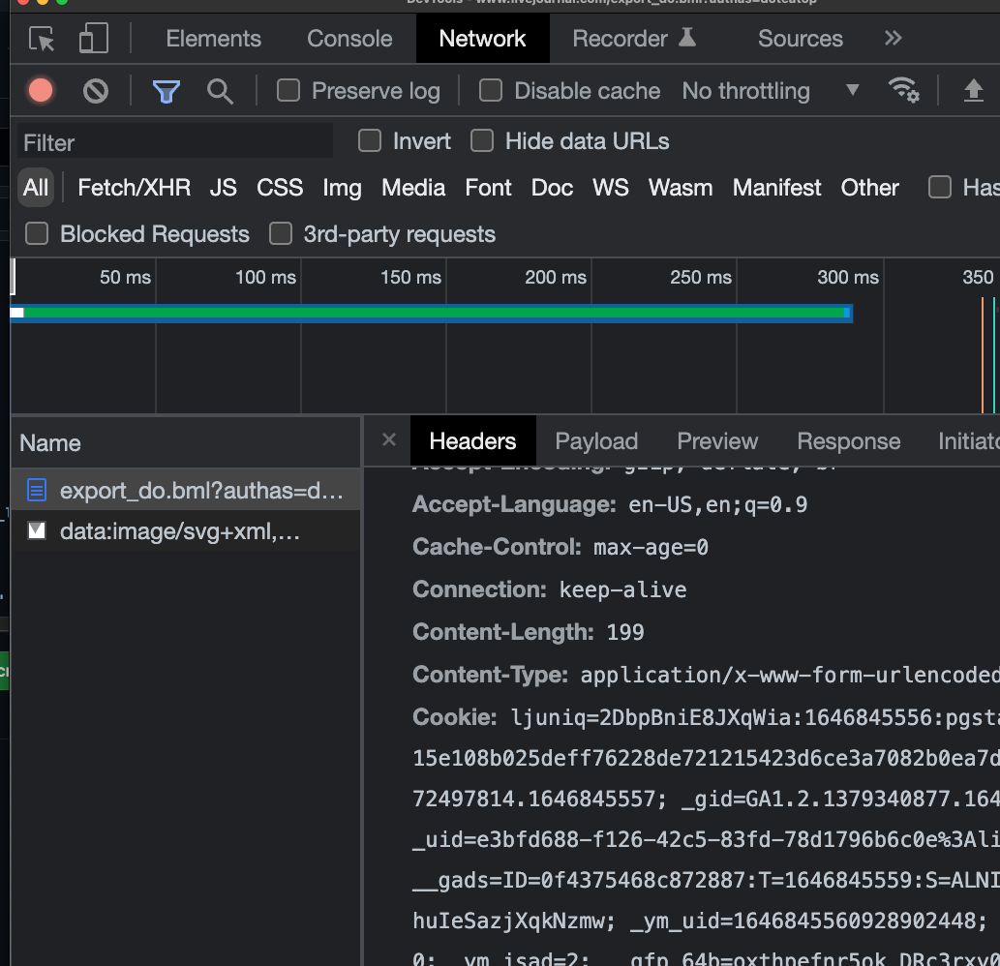

# What is this

I heard a rumor that Livejournal might be disconnected from the internet due to the war, so I made a quick script to export my stuff (even though I have tried to do this multiple times over the years, who knows, just to be on the safe side).

This is lofi as hell, just posting it to be helpful. It just gets your posts and the metadata, no comments, no images, just the stuff the LJ export tool will give you, also, it is in XML. Probably using Dreamwidth or something would be better but none of those things ever worked for me.

# Usage

First, login to their website, second, copy your cookie out of your browser's developer tools panel into a file named `COOKIE` in this directory.



Next, call it from bash like this (put your username where `username` is in there):

```
 cat YEARS | while read YEAR ; do cat MONTHS | while read MONTH ; do sleep 1 ; ./export.sh username $YEAR $MONTH ; done ; done
```
